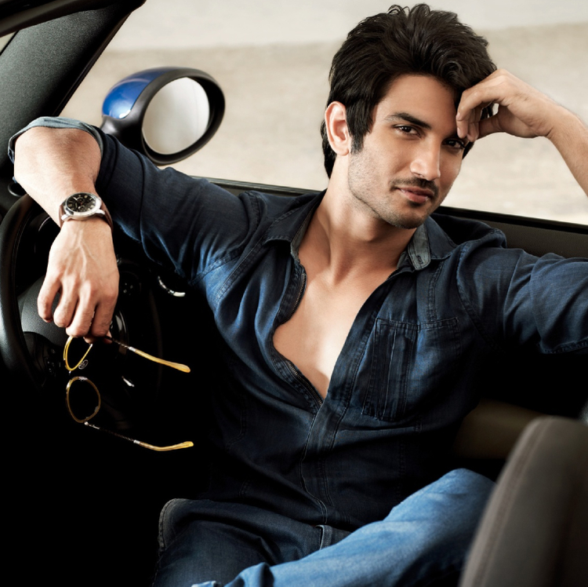

# <u>Sushant Singh Rajput</u>

**<u>Synopsis:</u> Facts supporting that Sushant Singh Rajput could have been murdered!**

**Criminal Advocates who have seen murder and suicide cases in life have tweeted thats it may be a murder. The tweet is now deleted because it contained the picture of the Sushant's dead body.**

**<u>The</u> <u>Original</u> <u>Tweet</u>  
As it seems from photograph it's prima facie confirm case of murder.  
Ring along the neck is not slanted. No Saliva outside mouth, tongue and eye ball normal. They are not out.**

**<u>Point 1</u>**  
He points out a doctrine common in criminal law,  
"A person who knows swimming cannot kill himself by jumping in water". Last minute agony will compel him to pull out.  
Similarly, A person who can handle his body weight with his hands will pull himself out and cannot hang himself!

**<u>Point 2</u>**  
He also said - The Doctor has stated cause of death due to hanging. Which is overreaching of jurisdiction. Death may be due to asphyxiation, but that asphyxiation was caused before or after the hanging is matter of investigation, which is not concluded. And police has general tendency to take the route which will increase the number of solved cases, which often lead to compromise with truth.

**<u>Point 3</u>**  
If you think he quit because he did not get films? We also recently discovered that Filmmaker Anand Gandhi roped in to cast Sushant for his next films "Emergence" after the death of the original hero in his mind, Irrfan.  
Rumy Jaffry was also about to start shooting with Sushant for his next romantic film.

**<u>Point 4</u>**  
A Week back in his ex-manager named **Disha Salian** died. According to the report she committed suicide by jumping off the 14th Floor of her building.  
**Manmeet Grewal & Preksha Mehta** - Two more of his friends had also reportedly committed suicide. We don't know if it was a suicide though. (We saw a reporter claiming them to be linked, but not able to find another source, so this should not be compelled believed).

**<u>Point 5</u>**  
The only people who have seen Sushant hanging were the three present in the house.  
They claimed he hung with the help of the curtains, but the marks on his neck looks like those of a plastic rope.  
(You can find his death pics online)

**<u>Point 6</u>**  
Sushant spoke to his sister at 9am according to Police. The servants claim that he came out at around 9:30am, drank pomegranate juice and went back and locked himself up.  
Seriously? He comes out to drink a glass of juice and hangs himself?  
Did emotions changed after drinking the juice? We could never say!

**<u>Point 7</u>**  
This point is no way related to reasons for his murder, but could be of importance in explaining his situation. It is also said that Bollywood has banned Sushant from doing movies and he could only do TV and Series from now on, after his last movie **Dil Bechara**

**<u>Point 8</u>**  
As per sources, Sushant organised a closed friends group party at his house the previous night.  
He was in talks with his dad maintaining family touch. There is no evidence that his cause of his death was suicide due to depression.  
Even if he was in depression, someone could have used it as a tool to plan his murder.

**<u>Point 9</u>**  
He is not "I Quit" type.  
**Former MP Pappu Yadav says**, "Sushant cannot commit suicide, he has been murdered" after meeting Sushant's family post his death.  
Sushant's family and his maternal uncle also claims that he has been murdered.  
They don't have any confidence on the Mumbai Police as they are affiliated with Politicians and Bollywood Biggies.

**<u>Point 10</u>**  
There is no suicide note found after his death.  
If someone is so depressed and is going to die,  
Won't he let his feelings out to the world before committing such an art?

**<u>Point 11</u>**  
And this everyone knows:  
He played the lead role in Chhichhore,  
A movie that focuses on not giving up on life no matter what!

**<u>Point 12</u>**  
There was no financial crisis,  
His sister mentioned the same.  
She knew that Sushant was depressed, but never expected he would take such a drastic step.  
Who knows if he has taken any step?

**<u>Point 13</u>**  
After the death of her ex-manager, Writer cum Director Rumi Jaffrey asked him to take care.  
Sushant replied, "Love you sir, meet you soon."  
Similar texts of meeting people soon has been reported.

**------------------------------------------------------------------------------------------**  

**The more I read about him, the more i am feeling depressed.  
He could have made a huge impact with his character, knowledge and actions.  
I am mourning the loss of positivity that he would have spread, the loss of aid he would have provided by checking off the list of 50 goals.  
Such a humble, intellectual and lively human, gone too soon.  
If this was a murder and we all settle for the fact that it is a suicide then it would be a shame for us.  
We must fight to get the truth out.  
If Suicide, What kind of Depression? If Murder, then why?  
He started writing journals a month back, it must be found and used as a piece of legal evidence.  
**

**<u>Edit 1:</u>** Advocate says his family has to come forward.  
Someone from his family member will have to raise voice for impartial investigation.  
In Criminal matters, Others have no focus to raise any objection before court of law.  
We can only write, but the real power is in the hands of his family.

**<u>Edit 2:</u>** If you agree, please raise your voice in your own way.  
The media might divert us using topics like nepotism or depression.  
If you feel from the gut that this guy cannot commit suicide, do something about it.

**<u>Edit 3:</u>** As far as I can see, Celebrities and Popular Social Media account holders have totally stopped assuming that it could be a murder.  
They are talking about Depression or Nepotism.  
Some are saying Depression is not so easily understood.  
But such write-ups sometimes convinces me that he committed suicide,  
Even though deep within I know he could not have.  
If we let this thought die, we will never know. We have to keep trying!

**In Loving Memory of  
SUSHANT SINGH RAJPUT  
January 21, 1986 - June 14, 2020  
**

  

**<u>Credits:</u> Advocate Avanindra**
